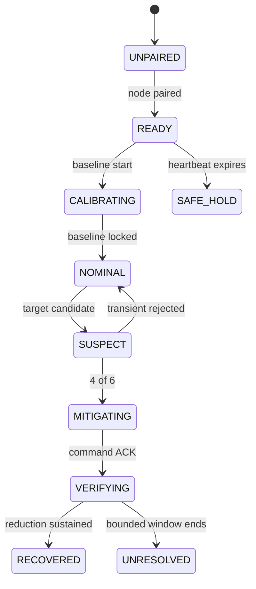

# CutHush architecture

## Physical loop

```mermaid
flowchart LR
    P["Phone node<br/>seeded sound"] -->|air| M["Laptop mic<br/>LIVE_MIC"]
    M --> D["Governor<br/>FFT + 4/6"]
    D -->|WebSocket command| P
    D --> E["Proof capsule<br/>SHA-256 chain"]
```

The same web application exposes `/cell/:room`, `/node/:room`, `/proof/:run`, and `/methodology`. FastAPI hosts the production SPA, room API, proof API, and protocol-validated WebSocket endpoint.

## Decision contract

| Stage | Evidence required | Failure behavior |
|---|---|---|
| Calibrate | Three seconds of local target-band power | No baseline means no green verdict |
| Suspect | ≥6 dB over baseline and ≥7 dB neighbour prominence | Transients return to NOMINAL |
| Trigger | At least four positive frames in a six-frame window | No command below persistence threshold |
| Mitigate | Fresh, unique, role-authorized command | Stale/duplicate commands are rejected |
| Verify | ≥6 dB reduction for eight consecutive frames | Ends UNRESOLVED after bounded window |
| Fail-safe | Controller heartbeats every 500 ms | Node ramps to zero after 1.2 s silence |

## State model

## Truth boundary

The phone is a deterministic bench audio proxy. The microphone and network control loop are real. Replay and live sources remain visibly distinct. The system never substitutes a fabricated success for missing evidence.
